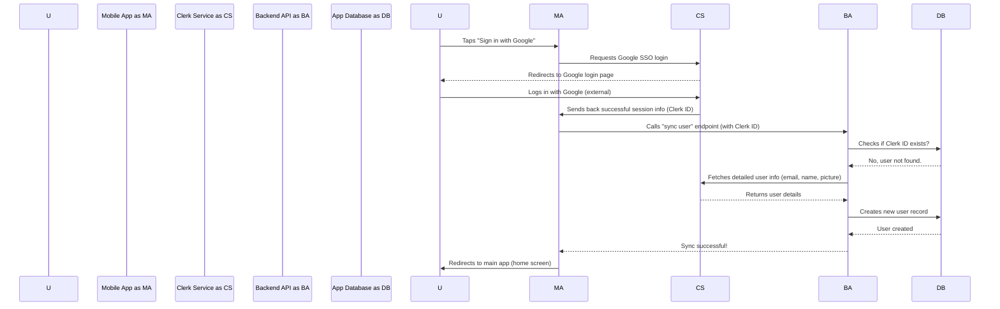

# Chapter 1: Clerk Authentication & User Sync

Welcome to the first chapter of our tutorial for `3s-connect-react-native`! In this chapter, we're going to dive into a super important topic for any app: user identity. Think about any social media app or online service you use – you need to create an account, log in, and the app needs to know who you are to show you your stuff, right? That's what **Clerk Authentication & User Sync** is all about.

## Why Do We Need This?

Imagine building your own social media app, let's call it "ConnectSphere". Users will want to:
*   **Sign up** for a new account.
*   **Log in** to their existing account.
*   Access **their own profile** and protected features (like posting comments or seeing their friends' updates).

Handling all of this from scratch – managing passwords, user databases, security, and different ways people can sign up (like with Google or GitHub) – is incredibly complex and risky. It's like trying to build a secure vault door entirely by yourself without any prior experience.

This is where **Clerk** comes in! Clerk is a specialized service that takes care of all the messy parts of user authentication for us. It provides ready-to-use login screens, securely stores user information, and makes it easy for our app to know who's logged in.

But there's a little twist: while Clerk handles the *authentication*, our app needs its *own* database to store things specific to "ConnectSphere," like posts, comments, or who a user follows. Clerk knows a user's email and name, but it doesn't know their "ConnectSphere" posts. So, we also need to **synchronize** (sync) the basic user info from Clerk into our app's database. This way, we have a complete picture of each user.

In short, this system ensures:
1.  Users can easily **sign up and log in**.
2.  Only **authorized users** can access private parts of the app.
3.  Our app's database always has the essential **user information** it needs, copied from Clerk.

## How Clerk Authentication Works (The Big Picture)

Let's break down how Clerk makes this happen in our mobile app and our backend server.

### On the Mobile App (Frontend)

The mobile app is what your users interact with. It needs to:
*   Show login/signup options.
*   Tell Clerk to handle the actual login.
*   Redirect the user to the main app once they're logged in.
*   Inform our backend that a new or existing user has logged in via Clerk, so we can sync their data.

Let's look at some code snippets that make this possible.

#### Setting up Clerk in Your App

First, our entire mobile app needs to be "Clerk-aware." We do this by wrapping our main app component with `ClerkProvider`.

```typescript
// mobile/app/_layout.tsx
import { ClerkProvider } from '@clerk/clerk-expo'
import { Stack } from 'expo-router' // Handles navigation

export default function RootLayout() {
  return (
    // ClerkProvider is like turning on a main switch for Clerk!
    <ClerkProvider>
      <Stack screenOptions={{headerShown:false}}>
        <Stack.Screen name='(auth)' /> // Screens for login/signup
        <Stack.Screen name='(tabs)' /> // Main app screens (home, profile, etc.)
      </Stack>
    </ClerkProvider>
  )
}
```
*Explanation*: This code makes sure that all parts of your app can talk to Clerk. Think of `ClerkProvider` as the central hub that gives your entire app access to Clerk's authentication magic. It also sets up our main navigation structure using `Stack.Screen`, separating our "authentication" pages from our "main app" pages.

#### Protecting Your App Routes

We don't want someone who isn't logged in to access the main parts of our app (like viewing their profile). We have a special layout file that acts like a bouncer.

```typescript
// mobile/app/(auth)/_layout.tsx
import { Redirect, Stack } from 'expo-router'
import { useAuth } from '@clerk/clerk-expo' // Clerk hook to check login status

export default function AuthRoutesLayout() {
  const { isSignedIn } = useAuth() // This checks if a user is currently logged in

  if (isSignedIn) {
    return <Redirect href="/(tabs)" /> // If logged in, send them to the main app!
  }

  return <Stack screenOptions={{headerShown:false}} /> // Otherwise, show the auth screens
}
```
*Explanation*: This file acts like a security guard at the entrance to your app. If `useAuth()` tells us that a user `isSignedIn` (they're logged in), it immediately sends them (`Redirect`) to the main part of the app (`/(tabs)`). If they're not signed in, it allows them to see the login and signup screens (`<Stack />`). A similar check is done for the main app tabs, redirecting back to auth if not signed in.

#### Social Login Buttons

Our "ConnectSphere" app lets users sign in with popular services like Google or GitHub.

```typescript
// mobile/app/(auth)/index.tsx
import { Image, Text, TouchableOpacity, View } from "react-native";
import { useSocialAuth } from "@/hooks/useSocialAuth"; // Our custom hook for social login

export default function Index() {
  const {isLoading, handleSocialAuth} = useSocialAuth(); // Get the login function

  return (
    <View className="flex-1 bg-white">
      {/* Button for Google Sign-in */}
      <TouchableOpacity onPress={() => handleSocialAuth("oauth_google")}>
        <Image source={require("../../assets/images/google.png")} />
        <Text>Continue with Google</Text>
      </TouchableOpacity>

      {/* Button for GitHub Sign-in (similar structure) */}
      <TouchableOpacity onPress={() => handleSocialAuth("oauth_github")}>
        <Image source={require("../../assets/images/github.png")} />
        <Text>Continue with GitHub</Text>
      </TouchableOpacity>
    </View>
  );
}
```
*Explanation*: This screen simply shows the "Continue with Google" and "Continue with GitHub" buttons. When a user taps one, it calls `handleSocialAuth`, which is a helper function we'll look at next. This function tells Clerk to start the social login process.

#### Handling the Social Login Flow

The `useSocialAuth` hook is where the magic of connecting to Google or GitHub via Clerk happens.

```typescript
// mobile/hooks/useSocialAuth.ts
import { useSSO } from "@clerk/clerk-expo"; // Clerk's Single Sign-On hook
import { useState } from "react"
import { Alert } from "react-native";

export const useSocialAuth = () =>{
  const [isLoading, setIsLoading] = useState(false);
  const {startSSOFlow} = useSSO(); // Clerk's function to start social login

  const handleSocialAuth = async(strategy : "oauth_google" | "oauth_github") =>{
    setIsLoading(true); // Show a loading spinner
    try {
      const {createdSessionId, setActive} = await startSSOFlow({strategy});

      if(createdSessionId && setActive){
        await setActive({session: createdSessionId}) // Tell Clerk the user is active!
      }
    } catch (error) {
      Alert.alert("Error", `Failed to sign in. Please try again!`)
    }finally{
      setIsLoading(false) // Hide loading spinner
    }
  }
  return {isLoading, handleSocialAuth}
}
```
*Explanation*: This hook is specifically designed to handle "Single Sign-On" (SSO), which is what happens when you log in using Google or GitHub. `useSSO()` from Clerk is a powerful tool that manages all the complex redirects and communications needed for this. When `startSSOFlow()` finishes successfully, it gives us a `sessionId`, which we then use with `setActive()` to tell Clerk that the user is now officially logged in.

#### Finishing the Login Process

After a social login (like with Google), the external service (Google) sends the user back to your app. There's a special file to catch this.

```typescript
// mobile/app/sso-callback.tsx
import { useEffect } from 'react';
import { useRouter } from 'expo-router';
import * as WebBrowser from 'expo-web-browser';

WebBrowser.maybeCompleteAuthSession(); // 👈 Essential for Clerk to finalize login

export default function SSOCallback() {
  const router = useRouter();

  useEffect(() => {
    // After Clerk finishes, redirect the user to the main app tabs
    router.replace('/(tabs)/');
  }, []);

  return null; // This screen doesn't show anything visually
}
```
*Explanation*: This file is a technical bridge. When you log in with an external provider (like Google), they redirect you back to your app, often landing on a specific URL. This `sso-callback.tsx` file is designed to be that landing spot. The `WebBrowser.maybeCompleteAuthSession()` line is crucial for Clerk to correctly process the information from the external provider and finalize the login in your app. Once done, it simply pushes the user to the main part of the application.

#### Syncing User Data to Your Backend

Once a user is successfully logged in with Clerk, we need to make sure their basic information is also available in *our* app's database. This is handled by another custom hook.

```typescript
// mobile/hooks/useUserSync.ts
import { useApiClient, userApi } from "@/utils/api"; // Our tools for talking to backend
import { useAuth } from "@clerk/clerk-expo"; // Check Clerk login status
import { useMutation } from "@tanstack/react-query"; // For making API calls

export const userUserSync = () => {
  const {isSignedIn} = useAuth(); // Is the user logged in via Clerk?
  const api = useApiClient() // Get our API client

  const syncUserMutation = useMutation({
        mutationFn: ()=> userApi.syncUser(api), // Calls our backend's sync endpoint
        onError:(error)=> console.log("User sync failed", error)
  });

  // Automatically sync user when signed in for the first time
  useEffect(()=>{
    if(isSignedIn && !syncUserMutation.data){
      syncUserMutation.mutate() // Trigger the sync user call to our backend!
    }
  },[isSignedIn]) // Run this effect whenever isSignedIn status changes

  return null; // This hook doesn't render anything
}
```
*Explanation*: This `useUserSync` hook is a silent but important worker. It constantly checks if a user is logged in (`isSignedIn`). If they are, and we haven't already synced their data, it automatically calls a special endpoint on our backend (named `syncUser`). This ensures that crucial user information (like their Clerk ID, email, and name) gets copied from Clerk into our app's own database, making them a "ConnectSphere" user.

### On the Backend Server

Our backend server is the brain of "ConnectSphere." It needs to:
*   Verify that requests from the mobile app are coming from authenticated (logged-in) users.
*   Get the unique ID of the logged-in user from Clerk.
*   Have an endpoint to receive the "sync user" request from the mobile app.
*   Store user information in its own database, linking it to the Clerk ID.

Let's explore how this works.

#### Backend Clerk Setup

Just like the mobile app, our backend server needs to be connected to Clerk.

```javascript
// backend/src/server.js
import express from "express";
import { clerkMiddleware } from "@clerk/express" // Clerk for backend

const app = express();
app.use(express.json()); // Allows parsing JSON requests
app.use(clerkMiddleware()); // This applies Clerk's security checks to all requests

// ... other route definitions ...
app.listen(ENV.PORT, () => console.log(`✔ Server running at http://localhost:${ENV.PORT}`));
```
*Explanation*: In our backend server, `clerkMiddleware()` acts like a security checkpoint for every incoming request. It automatically checks if a request came from a logged-in Clerk user and makes their information (like their unique Clerk ID) available to our backend code, so we know who is making the request.

#### Protecting Backend Routes

Many backend operations, like updating a profile or creating a post, should only be allowed for logged-in users. We use a "middleware" function for this.

```javascript
// backend/src/middleware/auth.middleware.js
export const protectRoute = async (req,res,next)=>{
  // Clerk middleware adds authentication info to req.auth
  if(!req.auth.isAuthenticated){ // Check if Clerk says the user is authenticated
    return res.status(401).json({message:"Unauthorized - you must be logged in !"});
  }
  next(); // If authenticated, allow the request to proceed to its destination
}
```
*Explanation*: This `protectRoute` function is a simple bodyguard for our API routes. It uses the `req.auth.isAuthenticated` property (which Clerk's middleware adds to the request) to quickly decide if a user is logged in. If not, it sends an "Unauthorized" message. If they are, the request continues to the actual function that handles the API request.

#### User Sync Logic on the Backend

This is the core of our user synchronization. The `sysncUser` function is what our mobile app calls when a user logs in.

```javascript
// backend/src/controllers/user.controller.js
import asyncHandler from 'express-async-handler' // Helps handle errors
import userModel from "../models/user.model.js" // Our user data model
import { clerkClient, getAuth } from '@clerk/express'; // Clerk tools for backend

export const sysncUser = asyncHandler(async(req,res)=>{
  const {userId} = getAuth(req); // Get the unique ID from the logged-in Clerk user

  const existingUser = await userModel.findOne({clerkID:userId})
  if(existingUser) return res.status(200).json({user:existingUser,message:"User already existed!"}) // User already in our DB!

  const clerkUser = await clerkClient.users.getUser(userId); // Get more details from Clerk (email, name)

  const userData = { // Prepare the data we want to save in our database
    clerkID: userId,
    email: clerkUser.emailAddresses[0].emailAddress,
    firstName : clerkUser.firstName || "",
    lastName :clerkUser.lastName || "",
    username: clerkUser.emailAddresses[0].emailAddress.split('@')[0], // Create a default username
    profilePicture: clerkUser.imageUrl || ""
  }

  const user = await  userModel.create(userData); // Save this user data to our app's database
  res.status(200).json({user:user, message:"User created Successfully!"})
})

export const updateUserProfile = asyncHandler(async (req, res) => {
  const { firstName, lastName, bio, location } = req.body;
  const { userId } = getAuth(req); // Get the ID of the currently logged-in user

  const user = await userModel.findOneAndUpdate(
    { clerkID: userId }, // Find the user in our DB using their Clerk ID
    { firstName, lastName, bio, location }, // Update their profile fields
    { new: true } // Return the updated user data
  );

  if (!user) return res.status(404).json({ error: 'User not found' });
  res.status(200).json({ user });
});
```
*Explanation*: This `sysncUser` function is the crucial part that ensures user data is consistent across Clerk and our local database.
1.  It uses `getAuth(req)` to grab the unique `userId` that Clerk provides for the currently logged-in user.
2.  It then checks our application's database (`userModel.findOne`) to see if a user with this `clerkID` already exists. If they do, it means they've been synced before, so we just send back a message.
3.  If the user is *not* found in our database, it means it's a new login or their first time using "ConnectSphere". So, we use `clerkClient.users.getUser(userId)` to fetch more detailed information about the user (like their full email, first name, profile picture URL) directly from Clerk.
4.  Finally, it takes this information, formats it (`userData`), and creates a new user record in our `userModel` (which represents our database table for users). This local record is essential for storing app-specific data like posts, followers, etc., that Clerk doesn't manage.

The `updateUserProfile` function also uses `getAuth(req)` to get the `userId` of the currently logged-in user. This `userId` (which is the Clerk ID) is then used to find and update that specific user's profile in *our* application database. This shows how the `clerkID` acts as the bridge between Clerk's user identity and our local user data.

## Step-by-Step: User Login and Sync

Let's put it all together with a simplified sequence of events when a user logs in for the first time using Google:



In this flow:
1.  The **User** starts the process from the **Mobile App**.
2.  The **Mobile App** hands off the tricky login part to the **Clerk Service**.
3.  The **Clerk Service** handles talking to Google (or GitHub) and getting the user authenticated.
4.  Once Clerk successfully logs the user in, it gives the **Mobile App** a unique ID for that user.
5.  The **Mobile App** then immediately contacts our **Backend API** to trigger the "sync user" process, sending along the Clerk user ID.
6.  The **Backend API** checks its **App Database**. If this Clerk ID isn't there (meaning it's a new user), it asks the **Clerk Service** for more details about the user (like their email and name).
7.  With this information, the **Backend API** creates a new user entry in our **App Database**.
8.  Finally, the **Mobile App** receives confirmation and sends the **User** to the main part of the application.

This ensures that every time a user logs in, their basic profile from Clerk is either already in our database or gets added automatically!

## Conclusion

In this chapter, we've learned how Clerk simplifies the complex world of user authentication, from signing up to logging in. We also understood the crucial concept of user synchronization, where we take essential user data from Clerk and store it in our own application database. This sets a strong foundation for managing users in our "ConnectSphere" app, ensuring security and data consistency without reinventing the wheel.

Next, we'll explore how we navigate through our application using Expo Router, and how it uses the authentication state we've just set up to show users the right screens.

[Next Chapter: Expo Router Navigation](02_expo_router_navigation_.md)

---
