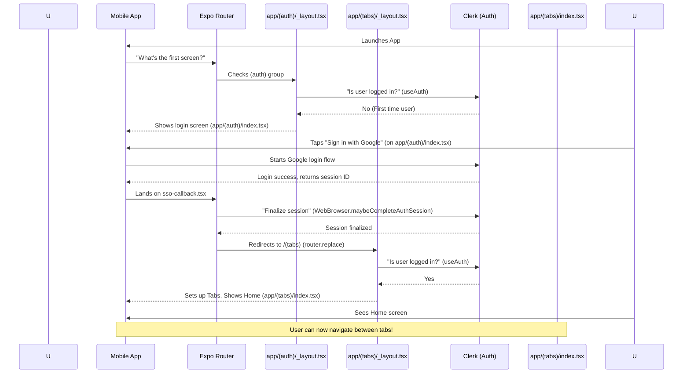

# Chapter 2: Expo Router Navigation

Welcome back to the `3s-connect-react-native` tutorial! In our [first chapter on Clerk Authentication & User Sync](01_clerk_authentication___user_sync_.md), we built the secure foundation for users to sign up and log in. We learned how to identify who is using our app. But once a user is logged in, how do they move from the login screen to their profile, or to their messages, or back to the home feed? This is where **Expo Router Navigation** comes in!

## What is Expo Router and Why Do We Need It?

Imagine your mobile app is a building, and each screen (like "Home," "Profile," "Messages") is a different room. **Expo Router** is like the building's internal GPS system. It tells your app:

*   **Where all the "rooms" (screens) are.**
*   **How users can travel between these rooms.**
*   **Which room to start in** when the app first opens, or after a user logs in.

Without a navigation system, your app would be just one static screen, or you'd have no way to move around. Expo Router solves this problem elegantly, making it easy to define all the different parts of your app and how users interact with them.

A central use case for us is: **When a user successfully logs in, how does the app automatically take them from the login screen to the main home screen, and prevent them from going back to the login screen until they log out?** Expo Router, combined with Clerk's authentication status, handles this beautifully.

## Key Concepts of Expo Router

Expo Router uses a very intuitive approach called "file-based routing." Let's break down the key ideas:

### 1. File-Based Routing: Your Files Are Your Screens

This is the most powerful and beginner-friendly feature of Expo Router. It means that **each React component file you place inside the `app/` directory automatically becomes a unique screen or "route" in your application.**

For example:
*   `app/index.tsx` becomes your app's main starting screen (`/`).
*   `app/profile.tsx` becomes the profile screen (`/profile`).
*   `app/settings.tsx` becomes the settings screen (`/settings`).

It's just like how folders and files on your computer create a structure!

### 2. Layout Files (`_layout.tsx`): Grouping Screens and Adding Logic

Sometimes, you want a group of screens to share a common look or behavior. For instance, all your main app screens might have a bottom navigation bar (tabs), or all your login/signup screens might not show a header.

This is where `_layout.tsx` files come in. A `_layout.tsx` file inside a directory will control how all the other files (screens) *inside that same directory* are displayed.

For example:
*   `app/(tabs)/_layout.tsx` controls all the screens within the `(tabs)` folder, allowing us to create a bottom tab bar.
*   `app/(auth)/_layout.tsx` controls all the screens within the `(auth)` folder, like login and signup. We use this to decide if a user should *even be allowed* to see these screens.

The parentheses `()` around `auth` and `tabs` in `(auth)` and `(tabs)` mean these are "route groups." They help organize your files but **don't add an extra part to the actual URL path**. So, `app/(auth)/index.tsx` is still just `/`.

### 3. Redirects: Sending Users to the Right Place

The `Redirect` component is like a traffic cop. If a certain condition is met, it immediately sends the user to a different screen. This is crucial for our login example!

```typescript
// Example of a Redirect
import { Redirect } from 'expo-router';
// ... inside a component
if (userIsLoggedIn) {
  return <Redirect href="/main-app-home" />; // Go to main app
}
// ... otherwise, show the current screen
```
*Explanation*: If `userIsLoggedIn` is `true`, the `Redirect` component will instantly move the user to the `/main-app-home` route, without them even seeing the current screen.

### 4. `useRouter` Hook: Programmatic Navigation

While `Redirect` is great for immediate, conditional jumps, sometimes you want to move the user after they tap a button, or after an action finishes. The `useRouter` hook lets you do this with code.

```typescript
// Example of useRouter
import { useRouter } from 'expo-router';

function MyButton() {
  const router = useRouter(); // Get the router object

  const handlePress = () => {
    // After doing something, navigate to the profile screen
    router.push('/profile');
  };

  return <Button title="Go to Profile" onPress={handlePress} />;
}
```
*Explanation*: The `useRouter()` hook gives you a `router` object. You can then use `router.push('/profile')` to move to the profile screen (adding it to the history, so the user can go back) or `router.replace('/main-app-home')` to replace the current screen in the history (so they can't go back to the previous screen).

## Solving Our Use Case: Login to Home Screen

Let's revisit our use case: **How do we ensure that after a user logs in (or if they're already logged in), they land on the main app screen and can't go back to the login page?**

Expo Router achieves this by strategically placing `_layout.tsx` files and using `Redirect` components, all powered by the `isSignedIn` status from [Clerk Authentication & User Sync](01_clerk_authentication___user_sync_.md).

### The Root Layout (`app/_layout.tsx`)

This is the top-level navigation setup for our entire app. It defines two main "stacks" or groups of screens: `(auth)` for login/signup and `(tabs)` for the main app content.

```typescript
// mobile/app/_layout.tsx
import { ClerkProvider } from '@clerk/clerk-expo'
import { Stack } from 'expo-router' // Our navigation stack!
import { QueryClient, QueryClientProvider } from "@tanstack/react-query" // For data management (next chapters)

const queryClient = new QueryClient(); // Setup for data management

export default function RootLayout() {
  return (
    // ClerkProvider makes Clerk available everywhere (from Chapter 1)
    <ClerkProvider>
      {/* QueryClientProvider for data management (Chapter 7) */}
      <QueryClientProvider client={queryClient} >
        {/* Stack defines how our main screen groups are laid out */}
        <Stack screenOptions={{headerShown:false}}>
          <Stack.Screen name='(auth)' /> // Screens for login/signup
          <Stack.Screen name='(tabs)' /> // Main app screens (home, profile, etc.)
          {/* sso-callback screen is for internal Clerk redirects, not visible */}
          <Stack.Screen name='sso-callback' /> 
        </Stack>
      </QueryClientProvider>
    </ClerkProvider>
  )
}
```
*Explanation*: This `_layout.tsx` at the root tells Expo Router that our app has two main "branches": `(auth)` (for authentication) and `(tabs)` (for the authenticated part of the app). `Stack.Screen` here means these groups will behave like a stack of cards, where only one is visible at a time.

### The Authentication Layout (`app/(auth)/_layout.tsx`)

This is the "bouncer" for our authentication screens. It checks if the user is already logged in.

```typescript
// mobile/app/(auth)/_layout.tsx
import { Redirect, Stack } from 'expo-router'
import { useAuth } from '@clerk/clerk-expo' // Clerk hook to check login status

export default function AuthRoutesLayout() {
  const { isSignedIn } = useAuth() // This checks if a user is currently logged in

  if (isSignedIn) {
    return <Redirect href="/(tabs)" /> // If logged in, send them to the main app!
  }

  return <Stack screenOptions={{headerShown:false}} /> // Otherwise, show the auth screens
}
```
*Explanation*: This file lives inside the `(auth)` folder. Before any screen in `(auth)` (like `index.tsx` which is our login screen) can be shown, this `_layout.tsx` runs. If `useAuth()` tells us the user `isSignedIn`, it immediately uses `Redirect` to send them to the `/(tabs)` route group, which holds our main app content. If they are *not* signed in, it proceeds to show the `Stack` of screens within `(auth)`.

### The Main App Tabs Layout (`app/(tabs)/_layout.tsx`)

This is the "bouncer" for our main app. It ensures that only logged-in users can access these screens and sets up the familiar bottom tab bar.

```typescript
// mobile/app/(tabs)/_layout.tsx
import { Redirect, Tabs } from 'expo-router'
import { Feather } from '@expo/vector-icons' // For icons in the tabs
import { useSafeAreaInsets } from 'react-native-safe-area-context' // For safe area around tabs
import { useAuth } from '@clerk/clerk-expo' // Clerk hook

const TabsLayout = () => {
  const insets = useSafeAreaInsets();
  const {isSignedIn} = useAuth(); // Is the user logged in?

  // If NOT signed in, send them back to the authentication screens!
  if(!isSignedIn) return <Redirect href={"/(auth)"} />

  return (
   <Tabs // This component creates a bottom tab bar
   screenOptions={{
    tabBarActiveTintColor:"#1DA1F2", // Styling for active tab
    tabBarInactiveTintColor:"#657786", // Styling for inactive tab
    tabBarStyle:{ // Styling for the tab bar itself
      height:50+insets.bottom, // Adjust height for safe area
    },
    headerShown:false, // Hide headers on tab screens
   }}
   >
    <Tabs.Screen
    name='index' // This corresponds to app/(tabs)/index.tsx
    options={{
      title:"", // No title on the tab itself
      tabBarIcon:(({color,size})=> <Feather name='home' size={size} color={color}  />)
    }}
     />
     
    <Tabs.Screen // Other tabs, like search, notifications, messages, profile
    name='search' options={{ title:"", tabBarIcon:(({color,size})=> <Feather name='search' size={size} color={color}  />)}} />
    <Tabs.Screen name='notifications' options={{ title:"", tabBarIcon:(({color,size})=> <Feather name='bell' size={size} color={color}  />)}} />
    <Tabs.Screen name='messages' options={{ title:"", tabBarIcon:(({color,size})=> <Feather name='mail' size={size} color={color}  />)}} />
    <Tabs.Screen name='profile' options={{ title:"", tabBarIcon:(({color,size})=> <Feather name='user' size={size} color={color}  />)}} />
   </Tabs>
  )
}

export default TabsLayout
```
*Explanation*: This `_layout.tsx` file lives inside the `(tabs)` folder. It first acts as another security check: if `!isSignedIn` (user is *not* logged in), it redirects them back to `/(auth)`. If they *are* signed in, it then sets up a `Tabs` navigation component. Each `Tabs.Screen` inside this `Tabs` component corresponds to a file in the `(tabs)` folder (e.g., `name='index'` refers to `app/(tabs)/index.tsx`). This is how our app gets its bottom navigation bar.

### Example Screen (`app/(tabs)/index.tsx`)

This is just one of the many screens that are part of the `(tabs)` group.

```typescript
// mobile/app/(tabs)/index.tsx
import { View, Text, ScrollView, Image } from 'react-native'
import React from 'react'
import { SafeAreaView } from 'react-native-safe-area-context'
import SingOutButton from '@/components/SingOutButton' // A button to log out
import { userUserSync } from '@/hooks/useUserSync' // From Chapter 1

const HomeSceen = () => {
  // This hook helps ensure user data is synced (from Chapter 1)
  userUserSync(); 
  return (
    <SafeAreaView className='flex-1'>
      <View className='flex-row justify-between items-center px-4 py-3 border-b-2 border-gray-200' >
        <Image source={require("../../assets/images/logo.png")} className='w-8 h-8' resizeMode='contain'/>
        <Text className='text-xl font-bold  text-gray-900'>HOME</Text>
        <SingOutButton />
      </View>
      <ScrollView showsVerticalScrollIndicator={false} className='flex-1'>
        {/* Content for the home screen */}
      </ScrollView>
    </SafeAreaView>
  )
}

export default HomeSceen
```
*Explanation*: This is the actual "Home" screen content. Since it's located at `app/(tabs)/index.tsx`, it will be the default screen shown when the user lands in the `(tabs)` group. The `SingOutButton` here, when pressed, would use Clerk's `signOut()` function (not shown in snippet, but part of Clerk's API) which would then make `isSignedIn` false, triggering the `Redirect` in `app/(tabs)/_layout.tsx` to send the user back to the login screen.

### The SSO Callback (`app/sso-callback.tsx`)

This special file handles the final step after a social login (like Google).

```typescript
// mobile/app/sso-callback.tsx
import { useEffect } from 'react';
import { useRouter } from 'expo-router'; // The hook to navigate
import * as WebBrowser from 'expo-web-browser'; // For handling browser interactions

// Essential for Clerk to finalize the login process
WebBrowser.maybeCompleteAuthSession(); 

export default function SSOCallback() {
  const router = useRouter(); // Get the router object

  useEffect(() => {
    // After Clerk successfully processes the SSO, redirect the user
    router.replace('/(tabs)/'); // Send them to the main app, replacing history
  }, []);

  return null; // This screen doesn't show anything visually, it just redirects
}
```
*Explanation*: When you log in with Google, Google sends you back to your app. This file is configured to catch that return. `WebBrowser.maybeCompleteAuthSession()` is crucial for Clerk to complete the secure handshake. Once done, `router.replace('/(tabs)/')` navigates the user to the main app's tab screens, and importantly, `replace` means the user can't press "back" to go to the login flow again.

## How Expo Router Works Under the Hood (Simplified)

Let's trace the journey of a user logging in and navigating, with our internal GPS system (Expo Router) at work:



**Step-by-step Explanation:**

1.  **App Launch:** When the user opens the app, Expo Router (our GPS) is the first thing consulted.
2.  **Root Layout:** The `app/_layout.tsx` tells the router we have two main paths: `(auth)` and `(tabs)`.
3.  **Authentication Check:** Since we start with `(auth)` as the first `Stack.Screen`, the router looks into `app/(auth)/_layout.tsx`. This layout immediately asks [Clerk Authentication & User Sync](01_clerk_authentication___user_sync_.md) (`useAuth`) if the user is `isSignedIn`.
4.  **First-Time Login:** If the user is *not* signed in (it's their first time), `app/(auth)/_layout.tsx` allows the login screens (like `app/(auth)/index.tsx`) to be shown.
5.  **Social Login:** The user taps "Sign in with Google," which uses Clerk to handle the actual login process.
6.  **SSO Callback:** After Google confirms the login, it sends the user back to our app, specifically to `app/sso-callback.tsx`. This file quickly finalizes the Clerk session and then uses `router.replace('/(tabs)/')` to send the user directly to the main app, ensuring they can't go back to the login screen using the back button.
7.  **Main App Entry:** Now, the router looks into `app/(tabs)/_layout.tsx`. This layout again checks `isSignedIn`. This time, Clerk confirms the user *is* signed in.
8.  **Tabs Displayed:** `app/(tabs)/_layout.tsx` then proceeds to set up the bottom `Tabs` bar and displays the default screen in that group, which is `app/(tabs)/index.tsx` (our Home screen).
9.  **Seamless Experience:** From now on, whenever the user opens the app and is already signed in, the `app/(auth)/_layout.tsx` will immediately redirect them to `/(tabs)`, skipping the login screen entirely.

## Conclusion

In this chapter, we've explored Expo Router, the crucial navigation system for our mobile app. We've learned about its powerful file-based routing, how `_layout.tsx` files organize and protect different sections of our app, and how `Redirect` and `useRouter` enable dynamic navigation. By combining Expo Router's navigation capabilities with Clerk's authentication state, we've built a smart system that ensures users always land on the correct screen, whether they are logging in or already authenticated.

Next, we'll dive into how we structure and manage data in our application using Mongoose, our tool for interacting with the database.

[Next Chapter: Mongoose Data Models](03_mongoose_data_models_.md)

---
