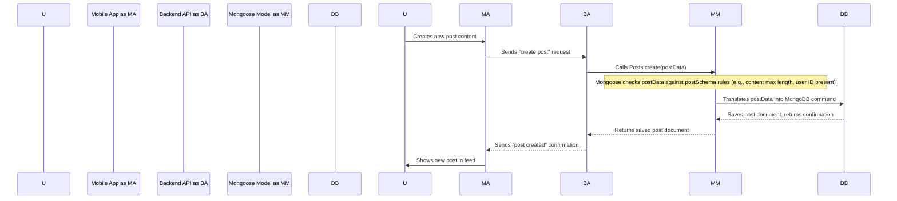

# Chapter 3: Mongoose Data Models

Welcome back to the `3s-connect-react-native` tutorial! In our [first chapter on Clerk Authentication & User Sync](01_clerk_authentication___user_sync_.md), we learned how to securely identify users. Then, in [Chapter 2: Expo Router Navigation](02_expo_router_navigation_.md), we built a smart system to guide users through our app screens once they're logged in.

Now that we know *who* is using our app and *how* they move around, what about the actual *stuff* they create or interact with? Things like user profiles, posts, comments, or notifications – where do we keep all this information, and how do we make sure it's organized and consistent? This is where **Mongoose Data Models** come in!

## Why Do We Need Mongoose Data Models?

Imagine our "ConnectSphere" app again. Users want to:
*   Create **posts** with text and images.
*   Add **comments** to posts.
*   **Follow** other users.
*   Receive **notifications** when someone likes their post.

All this information needs to be stored somewhere safe and accessible, which is our database (MongoDB). But a database is just a big storage locker. We need a way to tell our application and the database what kind of "things" we want to store and what they should look like.

**Central Use Case:** Let's say a user wants to create a **new post**. When they type their message and tap "Post," how does our app know:
1.  What pieces of information make up a "post" (e.g., text, image, who posted it)?
2.  What kind of data each piece is (e.g., text is a string, user ID is a special ID)?
3.  Are there any rules for this data (e.g., a post's text can't be longer than 280 characters)?

Without a blueprint, saving this data would be messy. Mongoose Data Models are like these blueprints! They define the structure, types, and relationships for all the information we store in our MongoDB database.

## Key Concepts of Mongoose Data Models

Mongoose is a tool (an "Object Data Modeling" or ODM library) that makes it much easier for our Node.js backend to talk to our MongoDB database. It sits between our code and the database, helping us define and interact with our data in a structured way.

Let's break down the main ideas:

### 1. Schema: The Blueprint

Think of a **Schema** as the detailed **blueprint** or **recipe** for a specific type of data. It tells Mongoose exactly what fields (or properties) a piece of data should have, what type of information each field holds, and any special rules.

For example, a `Post` schema would define that a post has `content` (which is text), an `image` (which is a link), and `user` (which is a reference to the user who made the post).

```javascript
// A simplified blueprint for a Post
import mongoose from "mongoose";

const postSchema = new mongoose.Schema(
  {
    content: {
      type: String, // This field will hold text
      maxLength: 280, // It can't be longer than 280 characters
    },
    image: {
      type: String, // This field will hold a link to an image
      default: "", // If no image, it's an empty string
    },
    user: {
      type: mongoose.Schema.Types.ObjectId, // This is a special ID linking to a User
      required: true, // Every post MUST have a user
      ref: "User", // This tells Mongoose it refers to the "User" model
    },
    // ... other parts like likes, comments
  },
  { timestamps: true } // Mongoose will automatically add 'createdAt' and 'updatedAt'
);
```
*Explanation*: This `postSchema` is our blueprint for a single post.
*   `content` is a `String` (text) and has a `maxLength` rule.
*   `image` is also a `String` (for the image URL) and has a `default` value if empty.
*   `user` is super important: it's not a regular string, but a `mongoose.Schema.Types.ObjectId`. This is how Mongoose stores references to other pieces of data in the database. The `ref: "User"` tells Mongoose that this `ObjectId` will point to a document in our `User` collection.
*   `timestamps: true` is a handy shortcut; Mongoose will automatically add fields like `createdAt` and `updatedAt` to track when posts are created and updated.

### 2. Model: The Builder

While the schema is the blueprint, the **Model** is like the **builder** or the **chef** who actually *uses* the blueprint/recipe. Once you have a schema, you turn it into a Mongoose model. This model then gives you all the tools you need to interact with your database: create new posts, find existing ones, update them, or delete them.

```javascript
// Creating a Mongoose Model from our Schema
import mongoose from "mongoose";

const postSchema = new mongoose.Schema({
  // ... (content, image, user fields as shown above)
});

// This line creates our "Post" Model from the "postSchema" blueprint
const Posts = mongoose.model("Post", postSchema);

export default Posts; // We can now use 'Posts' in other parts of our code
```
*Explanation*: `mongoose.model("Post", postSchema)` takes our `postSchema` blueprint and creates a `Posts` model. From now on, whenever we want to save, retrieve, or update post data in our database, we will use this `Posts` model (e.g., `Posts.create(...)`, `Posts.find(...)`).

### 3. Document: The Actual Data

A **Document** is an actual, single piece of data stored in your MongoDB database that follows a specific schema. If the schema is the blueprint for a "post," then an actual post a user creates (like "My first post on ConnectSphere!") is a "document."

When you use your `Posts` model to save data, you're creating a new "post document" in the database.

### 4. Relationships (`ObjectId` and `ref`): Connecting the Pieces

Our app isn't just a collection of separate pieces of data. Posts are made *by* users, comments are made *on* posts *by* users. These are **relationships**. Mongoose uses `mongoose.Schema.Types.ObjectId` and the `ref` property to define these connections.

When you see `type: mongoose.Schema.Types.ObjectId, ref: "User"`, it means this field will store the unique ID of a document from the "User" collection. This is how Mongoose knows how to link a post back to its creator, or a comment back to its post.

## Solving Our Use Case: Building ConnectSphere's Data Models

Let's look at the actual Mongoose models in our `3s-connect-react-native` project. You'll find these files in the `backend/src/models/` directory.

### The User Model (`backend/src/models/user.model.js`)

This is the blueprint for every user in our "ConnectSphere" database. Remember from [Chapter 1: Clerk Authentication & User Sync](01_clerk_authentication___user_sync_.md) that we sync basic user info from Clerk? This model defines where that info goes, plus other app-specific details like `bio` or `followers`.

```javascript
// backend/src/models/user.model.js
import mongoose from "mongoose";

const userSchema = new mongoose.Schema(
  {
    clerkID: {
      type: String,
      required: true,
      unique: true, // Each Clerk ID must be unique
    },
    email: {
      type: String,
      required: true,
      unique: true,
    },
    firstName: { type: String, required: true },
    lastName: { type: String, required: true },
    username: { type: String, required: true, unique: true },
    profilePicture:{ type:String, default:"" },
    bio:{ type:String, default:"", maxLength:160 },
    location:{ type:String, default:"" },
    followers:[
      {
        type: mongoose.Schema.Types.ObjectId,
        ref:"User" // References other User documents
      }
    ],
    following:[
      {
        type: mongoose.Schema.Types.ObjectId,
        ref:"User" // References other User documents
      }
    ]
  },
  { timestamps: true }
);

const User = mongoose.model("User",userSchema);
export default User;
```
*Explanation*:
*   We store `clerkID`, `email`, `firstName`, `lastName`, `username` directly synced from Clerk.
*   `unique: true` ensures no two users have the same `clerkID`, `email`, or `username`.
*   `profilePicture`, `bio`, `location` are optional fields that users can update in our app.
*   `followers` and `following` are arrays. Each item in these arrays is an `ObjectId` that refers to *another* `User` document. This is how we build the "following" relationship!

### The Post Model (`backend/src/models/post.model.js`)

This is our main example from earlier, defining how posts are structured.

```javascript
// backend/src/models/post.model.js
import mongoose from "mongoose";

const postSchema = new mongoose.Schema(
  {
    user: {
      type: mongoose.Schema.Types.ObjectId,
      required: true,
      ref:"User", // Each post belongs to a User
    },
    content: {
      type: String,
      maxLength: 280,
    },
    image: {
      type: String,
      default: "",
    },
    likes: [
      {
        type: mongoose.Schema.Types.ObjectId,
        ref: "User", // An array of Users who liked the post
      },
    ],
    comments:[{
      type: mongoose.Schema.Types.ObjectId,
      ref:"Comment" // An array of Comments on this post
    }]
  },
  { timestamps: true }
);

const Posts = mongoose.model("Post", postSchema)
export default Posts;
```
*Explanation*:
*   `user`: This links a post directly to the `User` who created it.
*   `content` and `image`: These hold the actual post content.
*   `likes`: This is an array of `User` IDs. When a user "likes" a post, their `_id` (the unique ID MongoDB gives to each document) is added to this list.
*   `comments`: This is an array of `Comment` IDs. This lets us easily find all comments related to a specific post.

### The Comment Model (`backend/src/models/comment.model.js`)

This blueprint defines what a comment looks like.

```javascript
// backend/src/models/comment.model.js
import mongoose from "mongoose";

const commentSchema = new mongoose.Schema(
  {
    user: {
      type: mongoose.Schema.Types.ObjectId,
      required: true,
      ref: "User", // Who made the comment
    },
    post: {
      type: mongoose.Schema.Types.ObjectId,
      ref: "Post", // Which post this comment is on
    },
    content: {
      type: String,
      required: true,
      maxLength: 280,
    },
    likes: [
      {
        type: mongoose.Schema.Types.ObjectId,
        ref: "User", // Who liked this comment
      },
    ],
  },
  { timestamps: true }
);

const Comments = mongoose.model("Comment", commentSchema);
export default Comments;
```
*Explanation*: A `Comment` is very similar to a `Post`, but it also has a `post` field, linking it to the specific `Post` document it belongs to.

### The Notification Model (`backend/src/models/notification.model.js`)

This model defines how notifications (like "User X liked your post") are structured.

```javascript
// backend/src/models/notification.model.js
import mongoose from "mongoose";

const notificationsSchema = new mongoose.Schema({
  from:{
    type: mongoose.Schema.Types.ObjectId,
    ref:"User", // Who triggered the notification
    required:true
  },
  to:{
    type: mongoose.Schema.Types.ObjectId,
    ref:"User", // Who receives the notification
    required:true
  },
  types:{
    type:String,
    required:true,
    enum:["follow","like","comment"] // What type of notification it is
  },
  post:{
    type: mongoose.Schema.Types.ObjectId,
    ref:"Post",
    default: null // If it's a post-related notification
  },
  comment:{
    type: mongoose.Schema.Types.ObjectId,
    ref:"Comment",
    default: null // If it's a comment-related notification
  },
},
{timestamps:true})

const notification = mongoose.model("Notification",notificationsSchema);
export default notification;
```
*Explanation*: This `Notification` model shows that a notification has a sender (`from`), a receiver (`to`), a `type` (e.g., "like"), and optionally links to a `Post` or `Comment` if relevant. Notice `enum` which limits the `types` field to only specific values.

## How Mongoose Works Under the Hood (Simplified)

Let's trace what happens when our "ConnectSphere" user creates a new post, from the perspective of Mongoose Data Models:



**Step-by-step Explanation:**

1.  **User Action:** A user types their post content into the `Mobile App` and taps "Post".
2.  **Request to Backend:** The `Mobile App` sends this post data (e.g., `{ content: "My first post!" }`) to our `Backend API`.
3.  **Using the Model:** The `Backend API` code (which we'll see in [Chapter 5: Backend API Controllers](05_backend_api_controllers_.md)) receives this data and then uses the `Posts` **Mongoose Model** (`Posts.create(postData)`).
4.  **Schema Validation:** The `Mongoose Model` takes the `postData` and first checks it against the `postSchema` blueprint. It ensures `content` is a string, its length is valid, and the `user` field (which our backend would add based on the logged-in user) is an `ObjectId` and is present.
5.  **MongoDB Command:** If everything looks good, `Mongoose` translates this data and the `create` command into something the `MongoDB` database understands.
6.  **Database Storage:** `MongoDB` saves this new "post document" and sends back a confirmation that it's saved, including the unique `_id` it assigned to the new post.
7.  **Mongoose Returns:** `Mongoose` takes this confirmation and returns the newly created post document (now with its `_id` and `timestamps`) back to our `Backend API`.
8.  **Backend Response:** The `Backend API` then sends a success message back to the `Mobile App`.
9.  **User Sees Post:** The `Mobile App` can now show the user their freshly created post!

This entire process ensures that every post, user, comment, and notification stored in our database follows a clear, consistent structure, making it easy to manage and retrieve data throughout our app.

## Conclusion

In this chapter, we've explored the fundamental concept of Mongoose Data Models. We learned that they act as blueprints (Schemas) for our data, defining its structure, types, and relationships. We then use these blueprints to create Models, which are our main tools for interacting with the database. Understanding these models is crucial because they ensure our "ConnectSphere" app's data is organized, consistent, and easy to work with.

Now that we know how to define what our data looks like, what if that data includes images or videos, like in a post? Our next chapter will cover how we handle **Cloudinary File Uploads** to manage these media files efficiently.

[Next Chapter: Cloudinary File Uploads](04_cloudinary_file_uploads_.md)

---
