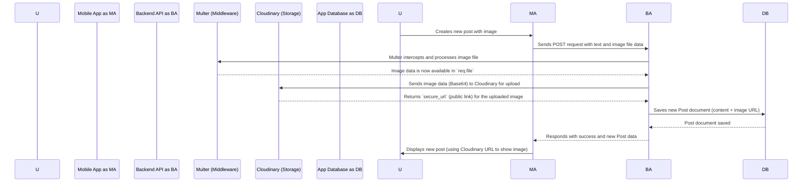

# Chapter 4: Cloudinary File Uploads

Welcome back to the `3s-connect-react-native` tutorial! In our [Chapter 3: Mongoose Data Models](03_mongoose_data_models_.md), we learned how to structure and organize all the text-based information in our app, like post content, user profiles, and comments. But what happens when our "ConnectSphere" users want to share pictures in their posts, or upload a cool new profile picture? Storing images directly in our database isn't ideal because they can be very large and slow things down.

This is where **Cloudinary File Uploads** comes in! It’s a dedicated service that helps us manage all our image and video files efficiently.

## Why Do We Need Cloudinary?

Imagine our "ConnectSphere" app is booming, and thousands of users are uploading photos every day. If we tried to store all these images directly in our database, it would quickly become:
*   **Slow**: Fetching posts would take ages as the database tries to retrieve large image files along with text.
*   **Expensive**: Databases are designed for structured text data, not massive binary files like images, so storing them directly can be costly.
*   **Complex**: Handling image resizing, optimization for different devices, and secure storage ourselves is a huge task.

**Central Use Case**: A user wants to **create a new post that includes an image**. When they select a photo and tap "Post," how does our app securely store this image, make it accessible to everyone, and ensure it loads quickly? Cloudinary provides the perfect solution by streamlining this complex process. It acts like a specialized, super-fast digital photo studio and storage locker for our app's media.

## Key Concepts of Cloudinary File Uploads

Cloudinary is a powerful, external cloud service specifically designed for media management. Here’s how it helps us:

### 1. External Cloud Storage

Instead of storing images in our own database or server, we send them to Cloudinary's servers. This frees up our database to focus on text data and makes our app faster. Think of it like sending your vacation photos to a professional photo service for safekeeping and easy sharing, rather than keeping all original, high-resolution files on your small phone.

### 2. Secure Uploads

When our app sends an image to Cloudinary, it does so securely. Cloudinary ensures the image is stored safely and provides a unique, unguessable link (URL) for each uploaded image.

### 3. Image Optimization and Transformation

This is where Cloudinary really shines! Once an image is uploaded:
*   **Resizing**: Cloudinary can automatically resize images to fit different screens (e.g., a smaller version for a thumbnail, a larger one for viewing).
*   **Compression**: It compresses images without losing quality, making them smaller and faster to download.
*   **Format Conversion**: It can convert images to the most efficient format (like WebP) on the fly.

All these transformations happen *on Cloudinary's side*, reducing the workload on our own server and making our app feel snappier to users.

## Solving Our Use Case: Uploading a Post Image

Let's see how our backend uses Cloudinary to handle image uploads for a new post. The process involves a few steps: configuring Cloudinary, setting up a way to receive files, and then using Cloudinary's API to upload and get the image URL.

### 1. Cloudinary Configuration (`backend/src/config/cloudinary.js`)

First, our backend needs to know how to connect to our Cloudinary account. We provide it with special keys (like a username and password) that Cloudinary gives us.

```javascript
// backend/src/config/cloudinary.js
import {v2 as cloudinary} from "cloudinary" // The Cloudinary library
import { ENV } from './env.js'; // Our environment variables

cloudinary.config({
  cloud_name: ENV.CLOUDINARY_CLOUD_NAME, // Your Cloudinary account name
  api_key: ENV.CLOUDINARY_API_KEY,       // Your Cloudinary API Key
  api_secret:   ENV.CLOUDINARY_API_SECRET // Your Cloudinary API Secret
})

export default cloudinary;
```
*Explanation*: This small file sets up the `cloudinary` object. `cloudinary.config()` tells the Cloudinary library which account to use by providing the `cloud_name`, `api_key`, and `api_secret`. These are sensitive keys, so we get them from `ENV` (environment variables), which are kept secret and not directly in our code.

### 2. Handling File Uploads (`backend/src/middleware/upload.middleware.js`)

Before Cloudinary can process an image, our backend server needs to actually *receive* the image file from the mobile app. We use a tool called `multer` for this. Multer is a "middleware" that sits in the middle of a request and helps parse incoming files.

```javascript
// backend/src/middleware/upload.middleware.js
import multer from "multer" // Multer helps handle file uploads

const fileFilter = (req,file,cb)=>{
  if(file.mimetype.startsWith("image/")){ // Only allow images
    cb(null,true)
  }else{
    cb(new Error("only Image can be uploaded"))
  }
}

const storage  = multer.memoryStorage(); // Store file in memory temporarily
const upload = multer({
  storage,
  fileFilter,
  limits: {fileSize: 5 *1024 *1024} // Max file size: 5MB
})

export default upload;
```
*Explanation*:
*   `multer.memoryStorage()` tells Multer to store the uploaded file in the server's memory temporarily. This is useful because we'll immediately send it to Cloudinary afterward.
*   `fileFilter` ensures that only image files can be uploaded.
*   `limits` sets a maximum file size (here, 5 megabytes) to prevent very large uploads.
*   The `upload` object is then used in our API routes to process incoming files. When a file is processed, Multer makes it available in `req.file` for our controller to use.

### 3. Creating a Post with Image Upload (`backend/src/controllers/post.controller.js`)

Now, let's look at the `createPost` function, which handles the logic for making a new post, including the image upload part.

```javascript
// backend/src/controllers/post.controller.js (simplified)
import asyncHandler from "express-async-handler";
import Post from "../models/post.model.js"; // Our Post data model
import User from "../models/user.model.js"; // Our User data model
import { getAuth } from "@clerk/express"; // Get user ID from Clerk
import cloudinary from "../config/cloudinary.js"; // Our Cloudinary config

export const createPost = asyncHandler(async (req, res) => {
  const { userId } = getAuth(req); // Get the ID of the logged-in user
  const { content } = req.body; // Get the text content from the request
  const imageFile = req.file; // Get the image file provided by Multer

  // Basic validation: must have text or an image
  if (!content && !imageFile) {
    return res.status(400).json({ error: "Post must have text or image" });
  }

  // Find the user in our database (from Chapter 1 & 3)
  const user = await User.findOne({ clerkID: userId });
  if (!user) return res.status(404).json({ error: "User not found !" });

  let imageUrl = ""; // Variable to store the Cloudinary image URL

  // If an image file was uploaded, process it with Cloudinary
  if (imageFile) {
    try {
      // 1. Convert the image file to a Base64 data URI
      // Cloudinary can accept files in this format directly
      const base64Image = `data:${imageFile.mimetype};base64,${imageFile.buffer.toString("base64")}`;

      // 2. Upload the Base64 image to Cloudinary
      const uploadResponse = await cloudinary.uploader.upload(base64Image, {
        folder: "3sConnect_posts", // Store in a specific folder on Cloudinary
        resource_type: "image",    // Tell Cloudinary it's an image
        transformation: [          // Apply image optimizations
          { width: 800, height: 600, crop: "limit" }, // Resize to fit within 800x600
          { quality: "auto" },                       // Auto-adjust quality
          { fetch_format: "auto" },                  // Auto-convert to best format (e.g., WebP)
        ],
      });

      // 3. Get the secure URL of the uploaded image
      imageUrl = uploadResponse.secure_url;
    } catch (error) {
      // Handle any errors during Cloudinary upload
      return res.status(400).json({
        error: error?.message || "Failed to upload file to Cloudinary",
      });
    }
  }

  // Create a new post in our database (Chapter 3: Mongoose Data Models)
  const post = await Post.create({
    content: content || "",  // Save the text content
    image: imageUrl,         // Save the Cloudinary image URL
    user: user._id,          // Link to the user who created it
  });

  res.status(201).json({ post }); // Send back the newly created post
});
```
*Explanation*:
1.  **Get Data**: The function first gets the `userId` of the logged-in user (from [Chapter 1: Clerk Authentication & User Sync](01_clerk_authentication___user_sync_.md)), the `content` (text) from the request body, and the `imageFile` (thanks to `multer`) from the request.
2.  **Image Processing**: If an `imageFile` exists:
    *   It converts the image data into a `base64Image` string. This is a text representation of the image that Cloudinary can easily understand for uploads.
    *   It then calls `cloudinary.uploader.upload()`, passing the `base64Image` and some options. The `folder` option organizes files on Cloudinary, and `transformation` options tell Cloudinary to optimize the image (resize, adjust quality, convert format) automatically.
    *   After a successful upload, Cloudinary sends back a `uploadResponse` object, which includes `secure_url`. This `secure_url` is the publicly accessible link to our optimized image!
3.  **Save to Database**: Finally, it creates a new `Post` document in our database (using the `Post` model from [Chapter 3: Mongoose Data Models](03_mongoose_data_models_.md)). Importantly, instead of storing the large image itself, we just save the small `imageUrl` (the Cloudinary link).

Now, whenever someone wants to view this post, our app simply uses the `imageUrl` to fetch the optimized image directly from Cloudinary, without burdening our own server or database.

## How Cloudinary Uploads Work Under the Hood (Simplified)

Let's trace the journey of an image from your mobile app to Cloudinary and finally into our database:



**Step-by-step Explanation:**

1.  **User Creates Post**: The `User` uses the `Mobile App` to create a post, selecting an image and adding text.
2.  **Mobile App Sends Data**: The `Mobile App` sends this information (text content and the raw image file) to our `Backend API`.
3.  **Multer Processes File**: The `Backend API` receives the request. The `Multer` middleware (our file handler) automatically intercepts the incoming file data, processes it, and makes it easily accessible as `req.file` for the rest of our code.
4.  **Backend Uploads to Cloudinary**: Our `Backend API` then takes the processed image data from `req.file`, converts it to a format Cloudinary likes (Base64), and sends it to the `Cloudinary` service.
5.  **Cloudinary Responds with URL**: `Cloudinary` stores the image, applies any requested optimizations (resizing, compressing), and then sends back a unique `secure_url` – the web address where the image can now be accessed.
6.  **Backend Saves URL to Database**: Our `Backend API` takes this `secure_url` and, along with the post's text content and the `user._id` (from [Chapter 3: Mongoose Data Models](03_mongoose_data_models_.md)), saves it as a new `Post` document in our `App Database`. We *don't* save the actual image data in our database, just the link to it on Cloudinary.
7.  **Success Response**: The `App Database` confirms the save, and the `Backend API` sends a success response back to the `Mobile App`.
8.  **Display Post**: The `Mobile App` receives the confirmation and displays the new post. When it needs to show the image, it simply uses the `secure_url` to fetch the optimized image directly from `Cloudinary`!

This entire flow ensures that image uploads are handled efficiently, securely, and without slowing down our core database or server.

## Conclusion

In this chapter, we've demystified **Cloudinary File Uploads**. We learned why it's essential to use an external service for media storage, how Cloudinary helps us securely upload, optimize, and serve images, and how we integrate it into our backend using `multer` and Cloudinary's API. By storing just the image URLs in our database (thanks to [Mongoose Data Models](03_mongoose_data_models_.md)), our "ConnectSphere" app can handle media-rich content like posts with images seamlessly and efficiently.

Next, we'll dive into **Backend API Controllers**, where we'll see how all these pieces (Clerk for authentication, Mongoose for data, and Cloudinary for files) come together to handle actual requests from our mobile app, like creating a post or fetching a user's profile.

[Next Chapter: Backend API Controllers](05_backend_api_controllers_.md)

---
