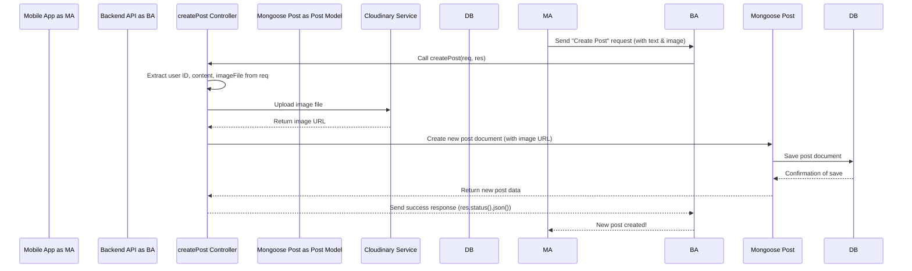

# Chapter 5: Backend API Controllers

Welcome back to the `3s-connect-react-native` tutorial! In our previous chapters, we've laid some strong foundations: we learned how to securely manage users with [Clerk Authentication & User Sync](01_clerk_authentication___user_sync_.md), built a smart navigation system with [Expo Router Navigation](02_expo_router_navigation_.md), structured our app's data with [Mongoose Data Models](03_mongoose_data_models_.md), and efficiently handled images with [Cloudinary File Uploads](04_cloudinary_file_uploads_.md).

Now, it's time to bring all these pieces together! How does our backend server actually *do* things when the mobile app asks it to? How does it decide what steps to take when you tap "Create Post" or "Like"? This is where **Backend API Controllers** come in.

## Why Do We Need Backend API Controllers?

Imagine your backend server is a busy kitchen, and the mobile app is a customer placing an order.
*   The customer (mobile app) doesn't know *how* to cook the food, just *what* they want (e.g., "I want to create a post!").
*   The kitchen (backend server) needs someone to take that order and follow a recipe to make it happen.

**Backend API Controllers** are like the **chefs** in that kitchen. They are the "brains" behind each specific action your app's backend can perform. When a request (an "order") arrives at an API route, the relevant controller takes over. It processes the request, interacts with the database models, talks to services like Cloudinary, and then constructs the appropriate response (the "prepared meal") to send back to the client.

**Central Use Case:** Let's say a user wants to **create a new post** from the mobile app. When they tap "Post," how does our backend server receive this request, store the post in the database, handle any images, and then tell the app that the post was created successfully? A **Post Controller** function is responsible for orchestrating all these steps.

## Key Concepts of Backend API Controllers

A controller in our backend is essentially a JavaScript function that acts as a bridge between an incoming request from the mobile app and the actual logic needed to fulfill that request.

### 1. The Controller Function: The Action Taker

A controller is just a regular function that takes two important arguments: `req` (short for request) and `res` (short for response).

*   **`req` (Request Object)**: This object contains all the information about the incoming request from the mobile app. This includes:
    *   `req.body`: Any data sent by the app in the request (like the text content of a post, or new profile information).
    *   `req.params`: Values that are part of the URL (like a `postId` from `/posts/123`).
    *   `req.query`: Values from the URL's query string (like `?page=2`).
    *   `req.file`: If the request includes a file upload (like an image), thanks to `multer` (from [Chapter 4: Cloudinary File Uploads](04_cloudinary_file_uploads_.md)), the file data will be here.
    *   `req.auth`: Authentication details about the logged-in user, provided by Clerk (from [Chapter 1: Clerk Authentication & User Sync](01_clerk_authentication___user_sync_.md)).

*   **`res` (Response Object)**: This object is what the controller uses to send information back to the mobile app. Key methods include:
    *   `res.status(statusCode)`: Sets the HTTP status code (e.g., `200` for OK, `201` for Created, `400` for Bad Request, `404` for Not Found, `500` for Server Error).
    *   `res.json(data)`: Sends a JSON object back to the app, which is how we typically send data.

### 2. Interacting with Data Models

One of the main jobs of a controller is to talk to our database. It uses the [Mongoose Data Models](03_mongoose_data_models_.md) (like `User`, `Post`, `Comment`) to perform operations like:
*   `Model.create(...)`: To add new data.
*   `Model.find(...)` or `Model.findById(...)`: To retrieve data.
*   `Model.findByIdAndUpdate(...)`: To change existing data.
*   `Model.findByIdAndDelete(...)`: To remove data.

### 3. Handling Errors with `asyncHandler`

Many of our controller functions involve waiting for things to happen (like talking to a database or Cloudinary). These are "asynchronous" operations. To make sure our errors are handled cleanly without crashing the server, we wrap our controller functions in `asyncHandler`. This small helper makes our code much cleaner and safer.

## Solving Our Use Case: Creating a Post with a Controller

Let's look at the `createPost` controller function in `backend/src/controllers/post.controller.js`. This function handles everything when a user creates a new post, including image uploads.

```javascript
// backend/src/controllers/post.controller.js (Simplified for clarity)
import asyncHandler from "express-async-handler";
import Post from "../models/post.model.js"; // Our Post model
import User from "../models/user.model.js"; // Our User model
import cloudinary from "../config/cloudinary.js"; // Cloudinary setup
import { getAuth } from "@clerk/express"; // For user ID from Clerk

export const createPost = asyncHandler(async (req, res) => {
  // 1. Get Input: Extract information from the request
  const { userId } = getAuth(req);     // Get ID of the logged-in user
  const { content } = req.body;        // Get post text from the request body
  const imageFile = req.file;          // Get attached image file (if any)

  if (!content && !imageFile) { // Basic check: post needs content or an image
    return res.status(400).json({ error: "Post must have text or image" });
  }

  // 2. Find the user: Ensure the user exists in our database
  const user = await User.findOne({ clerkID: userId });
  if (!user) return res.status(404).json({ error: "User not found !" });

  let imageUrl = ""; // This will hold the Cloudinary URL

  // 3. Handle Image Upload (if an image is provided)
  if (imageFile) {
    const base64Image = `data:${imageFile.mimetype};base64,${imageFile.buffer.toString("base64")}`;
    const uploadResponse = await cloudinary.uploader.upload(base64Image, {
      folder: "3sConnect_posts", // Store images in a specific folder
      resource_type: "image",
    });
    imageUrl = uploadResponse.secure_url; // Get the public URL
  }

  // 4. Create the Post in the Database
  const post = await Post.create({
    content: content || "",
    image: imageUrl,
    user: user._id, // Link this post to the user
  });

  // 5. Send Response: Tell the mobile app it was successful
  res.status(201).json({ post }); // 201 means "Created"
});
```
*Explanation*:
This single `createPost` function brings together many concepts:
1.  **Getting Input**: It uses `getAuth(req)` to identify the `userId` (from [Clerk Authentication & User Sync](01_clerk_authentication___user_sync_.md)), `req.body` for the text content, and `req.file` for the image (processed by `multer` from [Cloudinary File Uploads](04_cloudinary_file_uploads_.md)).
2.  **User Validation**: It uses the `User` [Mongoose Data Model](03_mongoose_data_models_.md) (`User.findOne`) to ensure the user exists in our database.
3.  **Image Upload**: If an image is present, it uses `cloudinary.uploader.upload` (from [Cloudinary File Uploads](04_cloudinary_file_uploads_.md)) to send the image to Cloudinary and get back its public `imageUrl`.
4.  **Database Interaction**: It then uses the `Post` [Mongoose Data Model](03_mongoose_data_models_.md) (`Post.create`) to save the new post's details (including the Cloudinary `imageUrl`) into our database.
5.  **Sending Response**: Finally, it uses `res.status().json()` to send a success message and the newly created post data back to the mobile app.

This entire sequence happens within one controller function, acting as the central point for handling the "create post" action.

## How Backend API Controllers Work Under the Hood (Simplified)

Let's trace the journey of a "create post" request when it hits our backend, focusing on how the controller orchestrates the process:



**Step-by-step Explanation:**

1.  **Request from App**: The `Mobile App` sends a request to the `Backend API` to create a new post, including the post's text content and potentially an image file.
2.  **Controller Takes Over**: The `Backend API` receives this request and, based on the URL, knows to hand it over to the `createPost` controller function.
3.  **Process Input**: The `createPost` controller function first extracts all the necessary information from the `req` object (user's ID, post text, and the image data).
4.  **Image Upload**: If an image is part of the request, the controller then sends that image data directly to the `Cloudinary Service`.
5.  **Cloudinary Response**: `Cloudinary` processes and stores the image, then sends back a public URL (link) where the image can be accessed.
6.  **Save to Database**: The controller then uses the `Post Model` (from [Mongoose Data Models](03_mongoose_data_models_.md)) to create a new post entry in the `Database`. It saves the text content and, importantly, the `image URL` received from Cloudinary, not the large image data itself.
7.  **Database Confirmation**: The `Database` confirms the save, and the `Post Model` passes this confirmation back to the controller.
8.  **Send Response to App**: Finally, the `createPost` controller constructs a success response (`res.status(201).json(...)`) and sends it back through the `Backend API` to the `Mobile App`, indicating that the post was successfully created.

## Another Example: Liking a Post

Controllers handle all sorts of actions, not just creating new data. Let's briefly look at the `likeAPost` controller, which handles when a user likes or unlikes a post.

```javascript
// backend/src/controllers/post.controller.js (Simplified)
// ... (imports for asyncHandler, Post, User, Notification, getAuth)

export const likeAPost = asyncHandler(async (req, res) => {
  const { userId } = getAuth(req);   // Who liked it?
  const { postId } = req.params;     // Which post was liked?

  const user = await User.findOne({ clerkID: userId });
  const post = await Post.findById(postId);

  if (!user || !post) { // Check if user and post exist
    return res.status(404).json({ error: "Post or User not found!" });
  }

  // Check if the user has already liked this post
  const isLiked = post.likes.some(id => id.equals(user._id));

  // Update the post's likes array in the database
  await Post.findByIdAndUpdate(
    postId,
    isLiked ? { $pull: { likes: user._id } } : { $push: { likes: user._id } }
  );

  // Create a notification for the post owner (if not liking their own post)
  if (!post.user.equals(user._id)) {
    await Notification.create({
      from: user._id, to: post.user, types: "like", post: postId,
    });
  }

  // Send success response
  res.status(200).json({
    message: isLiked ? "Post unliked successfully!" : "Post liked successfully!",
  });
});
```
*Explanation*:
This `likeAPost` controller function demonstrates:
*   **Getting Input**: It gets the `userId` from Clerk and the `postId` from the URL parameters (`req.params`).
*   **Finding Data**: It uses `User.findOne` and `Post.findById` to retrieve the relevant user and post documents from the database.
*   **Conditional Logic**: It checks `isLiked` to decide whether to add (`$push`) or remove (`$pull`) the user's ID from the `post.likes` array in the database.
*   **Creating Notifications**: If the user is liking someone else's post, it creates a new `Notification` document (using the `Notification` [Mongoose Data Model](03_mongoose_data_models_.md)) to alert the post's owner.
*   **Sending Response**: It sends a descriptive success message back to the mobile app.

As you can see, controllers are the central orchestrators for all the actions our backend performs, pulling together data models, external services, and authentication information to fulfill requests.

## Conclusion

In this chapter, we've explored the critical role of **Backend API Controllers**. We learned that these functions act as the "brains" or "chefs" of our backend, taking requests from the mobile app and orchestrating all the necessary steps – like interacting with [Mongoose Data Models](03_mongoose_data_models_.md) for database operations, handling files with [Cloudinary File Uploads](04_cloudinary_file_uploads_.md), and using user authentication from [Clerk Authentication & User Sync](01_clerk_authentication___user_sync_.md) – to process the request and send back a response.

Now that we understand what controllers do, the next logical step is to learn how our backend knows *which* controller to call for a specific incoming request. That's where **API Route Definitions** come in!

[Next Chapter: API Route Definitions](06_api_route_definitions_.md)

---
