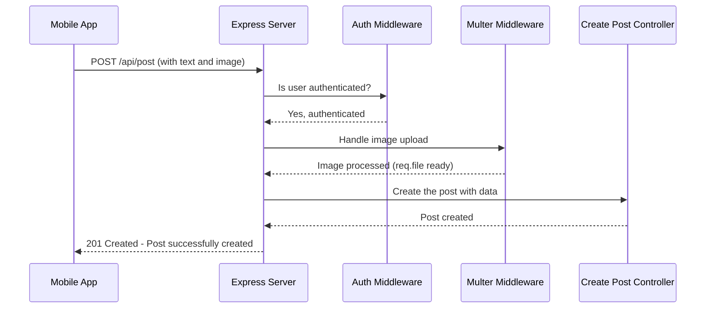

# Chapter 6: API Route Definitions

Welcome back to the `3s-connect-react-native` tutorial! In our last chapter, [Chapter 5: Backend API Controllers](05_backend_api_controllers_.md), we learned about the "chefs" (controller functions) in our backend kitchen. These chefs know how to cook up specific requests, like creating a post or liking content. But how do requests from the mobile app find the *right* chef? How does our backend server know which controller function to call when a specific request arrives?

This is where **API Route Definitions** come in! They act like a directory, or a map, for all the different operations your app's backend can handle. They specify the unique web addresses (URLs) for various client requests, the type of request (like "get information" or "create something"), and which controller function should be invoked to process it.

## Why Do We Need API Route Definitions?

Imagine our backend server is a restaurant. The mobile app is a customer.
*   The customer says, "I want to see all posts!" (a GET request to `/api/posts`).
*   Another customer says, "I want to create a new post with this text and image!" (a POST request to `/api/post`).
*   Yet another says, "I want to delete *this specific* post!" (a DELETE request to `/api/post/123`).

Without a clear "menu" or "signpost" system, the server would have no idea which "kitchen station" (controller function) should handle each of these very different requests. The API Route Definitions provide this system. They ensure that every incoming request is correctly directed to the exact piece of code that knows how to fulfill it.

**Central Use Case:** When a user taps the "Create Post" button in our mobile app, how does the app's request travel to the backend and specifically trigger the `createPost` controller function we saw in [Chapter 5: Backend API Controllers](05_backend_api_controllers_.md)? API Route Definitions are the answer! They define the exact path and method that maps to that specific controller.

## Key Concepts of API Route Definitions

In our `3s-connect-react-native` backend, we use **Express.js**, a popular Node.js framework, to define our API routes. Here are the core ideas:

### 1. The Route: A Unique Address for an Operation

An API route is a combination of:
*   **A URL Path**: This is the unique web address, like `/api/post` or `/api/users/profile`.
*   **An HTTP Method**: This describes the *type* of operation you want to perform. The most common ones are:
    *   **GET**: To *get* (read) information. (e.g., `GET /api/posts` to get all posts)
    *   **POST**: To *create* new information. (e.g., `POST /api/post` to create a new post)
    *   **PUT/PATCH**: To *update* existing information. (e.g., `PUT /api/users/profile` to update a user's profile)
    *   **DELETE**: To *delete* information. (e.g., `DELETE /api/post/123` to delete post with ID 123)
*   **Controller Functions (Handlers)**: These are the "chefs" we talked about. When a request matches a route's URL and method, the associated controller function (or functions, sometimes there are "middleware" steps first) is executed.

### 2. The `router` Object: Grouping Related Routes

Instead of putting all our routes in one giant file, we organize them into smaller, more manageable files using `express.Router()`. This is like having separate "menus" for different sections of our restaurant (e.g., a "Posts Menu," a "Users Menu").

```javascript
// A simplified example of creating a router
import express from 'express';
const router = express.Router(); // Create a new router object

// Now, define routes specific to this router
router.get("/", (req, res) => { /* handle getting data */ });
router.post("/", (req, res) => { /* handle creating data */ });

export default router; // Make this router available to other files
```
*Explanation*: `express.Router()` creates a mini-application that can handle its own routes. We define routes on this `router` object, and then we "mount" this router onto our main Express application.

### 3. Mounting Routers with `app.use()`: The Main Directory

The `app.use()` method in our main `server.js` file is crucial. It tells our main Express application: "For any request that starts with *this* URL path, hand it over to *this specific router file*."

```javascript
// A simplified example in server.js
import postRoute from "./routes/post.route.js"; // Import our post router

app.use("/api/post", postRoute); // Any request starting with /api/post will go to postRoute
```
*Explanation*: This line means:
*   If a request comes to `/api/post/`, it will be handled by `postRoute`.
*   If a request comes to `/api/post/123/like`, it will also be handled by `postRoute`.

This creates a clear structure: `server.js` acts as the main director, pointing requests to the right `router` file, and then each `router` file defines the specific actions (GET, POST, etc.) for its section.

## Solving Our Use Case: Defining the "Create Post" Route

Let's trace how the "Create Post" request finds its way using API Route Definitions in `3s-connect-react-native`.

### Step 1: The Main Application Director (`backend/src/server.js`)

This file is the main entry point for our backend. It sets up the server and directs major groups of requests to their respective route files.

```javascript
// backend/src/server.js (simplified)
import express from "express";
import postRoute from "./routes/post.route.js"; // Import the post routes
import userRoute from "./routes/user.route.js"; // Import the user routes
// ... other imports for comments, notifications

const app = express();
// ... other global middleware (like Clerk authentication middleware)

// Mount our route files to specific URL paths
app.use("/api/post", postRoute);       // Requests to /api/post... go to postRoute
app.use("/api/users", userRoute);     // Requests to /api/users... go to userRoute
// ... and so on for comments and notifications

// ... server start up and error handling
```
*Explanation*: When a request comes in (e.g., from the mobile app), the `server.js` file is the first to see it. The lines `app.use("/api/post", postRoute);` are like main signposts. They say: "If a request starts with `/api/post`, send it to the `postRoute` file for more detailed instructions."

### Step 2: The Specific Section's Menu (`backend/src/routes/post.route.js`)

Once a request for `/api/post` is directed to `postRoute`, this file takes over. It contains all the detailed route definitions for anything related to posts.

```javascript
// backend/src/routes/post.route.js (simplified)
import express from 'express';
// Import the specific controller functions (our "chefs")
import { createPost, getPosts, likeAPost } from '../controllers/post.controller.js';
// Import middleware for security and file uploads
import { protectRoute } from './../middleware/auth.middleware.js'; // From Chapter 1
import upload from '../middleware/upload.middleware.js'; // From Chapter 4

const router = express.Router(); // Create a router specific for posts

// Define specific routes for 'posts'
router.get("/", getPosts); // 1. GET /api/post -> Call getPosts controller (get all posts)
router.post("/", protectRoute, upload.single("image"), createPost); // 2. POST /api/post -> Call createPost controller
router.post("/:postId/like", protectRoute, likeAPost); // 3. POST /api/post/some-id/like -> Call likeAPost controller

export default router; // Make this post router available to server.js
```
*Explanation*:
*   This file defines a `router` specifically for `post` related actions.
*   `router.post("/", protectRoute, upload.single("image"), createPost);` is the key line for our use case!
    *   `router.post("/")`: This means it will handle `POST` requests. Since this router is mounted at `/api/post` in `server.js`, this specific route means `POST /api/post`.
    *   `protectRoute`: This is a "middleware" (from [Chapter 1: Clerk Authentication & User Sync](01_clerk_authentication___user_sync_.md)) that runs *before* `createPost`. It checks if the user is logged in. If not, it stops the request.
    *   `upload.single("image")`: This is another "middleware" (from [Chapter 4: Cloudinary File Uploads](04_cloudinary_file_uploads_.md)) that runs before `createPost`. It processes any image file attached to the request, making it ready for the controller.
    *   `createPost`: This is our "chef" (the controller function from [Chapter 5: Backend API Controllers](05_backend_api_controllers_.md)). If all the middleware steps pass, `createPost` is finally called to do the actual work of creating the post in the database.

## How API Route Definitions Work Under the Hood (Simplified)

Let's visualize the journey of a "Create Post" request from the mobile app to its final destination, guided by our API Route Definitions:



**Step-by-step Explanation:**

1.  **Mobile App Sends Request**: The `Mobile App` sends a `POST` request to the URL `/api/post`, containing the text content and image data for the new post.
2.  **Main Server Directs**: The `Backend Server` (`server.js`) receives this request. It checks its `app.use` rules and sees that any request starting with `/api/post` should be handled by the `postRoute` file. It passes the request along.
3.  **Post Routes Matches**: The `Post Routes` (`post.route.js`) file receives the request. It looks through its defined routes and finds a match: `POST /` (which, combined with the `/api/post` prefix, matches `POST /api/post`).
4.  **Middleware Execution (Authentication)**: Before calling the `createPost` controller, the `protectRoute` middleware is executed. It uses information from [Clerk Authentication & User Sync](01_clerk_authentication___user_sync_.md) to ensure the user is logged in. If not, it sends an error back. If yes, it allows the request to proceed.
5.  **Middleware Execution (File Upload)**: Next, the `upload.single("image")` middleware is executed. This uses `multer` (from [Chapter 4: Cloudinary File Uploads](04_cloudinary_file_uploads_.md)) to process the incoming image file.
6.  **Controller Invocation**: Once both middleware steps are successfully completed, the `createPost` controller function (from [Chapter 5: Backend API Controllers](05_backend_api_controllers_.md)) is finally called to perform the actual logic of creating the post in the database.
7.  **Response Back**: The `createPost` controller sends its response back through the chain (`Post Routes`, then `Backend Server`) until it reaches the `Mobile App`.

This layered approach ensures that requests are properly authenticated, files are handled, and the correct business logic is executed, all thanks to clearly defined API routes.

## Other API Route Examples

All other backend operations follow the same pattern of defining routes in their respective files and importing them into `server.js`.

**User Routes (`backend/src/routes/user.route.js`)**:
```javascript
// backend/src/routes/user.route.js (simplified)
import express from "express";
import { sysncUser, updateUserProfile, getUserProgile } from "../controllers/user.controller.js";
import { protectRoute } from "../middleware/auth.middleware.js";

const router = express.Router();

// Routes for user actions
router.get("/profile/:username", getUserProgile); // GET /api/users/profile/someuser -> getUserProfile
router.put("/profile", protectRoute, updateUserProfile); // PUT /api/users/profile -> updateUserProfile
router.post("/sync", protectRoute, sysncUser); // POST /api/users/sync -> syncUser (from Chapter 1)

export default router;
```
*Explanation*:
*   `router.get("/profile/:username", getUserProgile);` matches `GET` requests like `/api/users/profile/johndoe`. The `:username` part means it's a dynamic value (a "URL parameter") that `getUserProgile` can access.
*   `router.put("/profile", protectRoute, updateUserProfile);` uses `PUT` for updating a user's *own* profile.

**Comment Routes (`backend/src/routes/comment.route.js`)**:
```javascript
// backend/src/routes/comment.route.js (simplified)
import express from 'express';
import { protectRoute } from '../middleware/auth.middleware.js';
import { createComment, deleteComment, getComments } from '../controllers/comment.controller.js';

const router = express.Router();

router.get("/post/:postId", getComments); // GET /api/comment/post/123 -> getComments
router.post("/post/:postId", protectRoute, createComment); // POST /api/comment/post/123 -> createComment
router.delete("/:commentId", protectRoute, deleteComment); // DELETE /api/comment/456 -> deleteComment

export default router;
```
*Explanation*: These routes define how comments are fetched, created, and deleted, again using URL parameters like `:postId` and `:commentId` to target specific items.

## Conclusion

In this chapter, we've learned that **API Route Definitions** are the essential "map" for our backend server. They tell incoming requests from the mobile app exactly which path to take and which HTTP method to use to reach the correct controller function (our "chef") that can fulfill the request. By using `express.Router()` to organize our routes and `app.use()` to connect them in `server.js`, we create a clear, maintainable, and efficient system for handling all the different operations in our `3s-connect-react-native` application.

Now that we understand how our backend is structured to receive and process requests, the next step is to explore how our frontend mobile app efficiently *sends* these requests and *manages* the data it receives back. This is where **React Query Data Management** comes into play.

[Next Chapter: React Query Data Management](07_react_query_data_management_.md)

---
