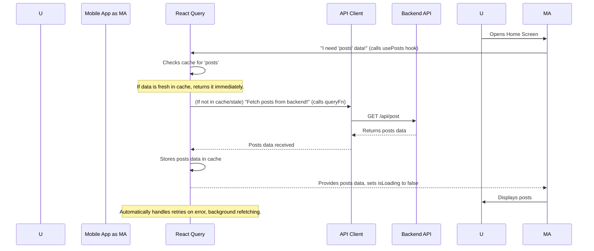
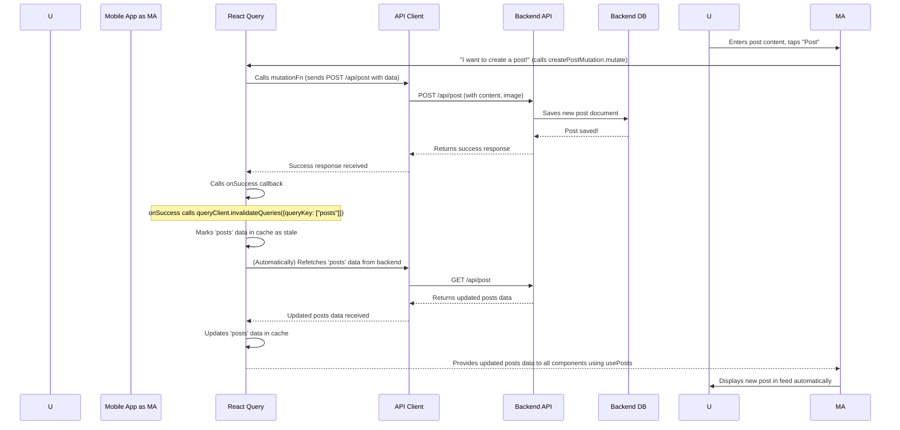

# Chapter 7: React Query Data Management

Welcome back to the `3s-connect-react-native` tutorial! In our [Chapter 6: API Route Definitions](06_api_route_definitions_.md), we learned how our backend server sets up specific "addresses" (routes) for different actions, making sure requests from the mobile app always find the right "chef" (controller function). Now that we know how the backend is structured to receive requests, how does our frontend mobile app efficiently *send* these requests and *manage* the data it receives back?

This is where **React Query Data Management** comes into play! On the mobile app, this abstraction acts like a smart data manager. Instead of manually fetching data every time or worrying about complex loading states and errors, it automatically handles getting data from the backend, intelligently caching it, keeping it fresh, and simplifying the management of UI loading and error states for a smoother user experience.

## Why Do We Need This?

Imagine our "ConnectSphere" app again. We want to show a list of posts, let users create new ones, and allow them to "like" posts. Without a smart data manager, we'd constantly run into challenges:

*   **Showing Loading States**: How do we show a "Loading..." message while we wait for posts to arrive?
*   **Handling Errors**: What if the internet cuts out or the server has a problem? How do we show an "Error, please try again!" message?
*   **Caching Data**: If a user goes to their profile and then back to the home feed, should we fetch *all* the posts again from scratch, or remember them temporarily to make the app feel faster?
*   **Keeping Data Fresh**: If someone else creates a new post, or if *you* create a post, how does your app know to refresh the list to show the latest content?
*   **Refetching After Changes**: After you "like" a post, how does the app instantly update the "like count" or the "liked" icon without you having to manually refresh the whole screen?

**Central Use Case**: How does our app efficiently display a list of posts, automatically show loading indicators, handle errors gracefully, and then automatically update the list when a *new* post is created or when an existing post is *liked*? React Query provides a powerful and easy way to handle all these scenarios.

## Key Concepts of React Query

React Query is a powerful library that simplifies data fetching, caching, synchronization, and managing server state in your React Native applications. Think of it as a "smart assistant" that handles all the tedious parts of getting and updating data for you.

### 1. The `QueryClient`: The Assistant's Main Office

At the core of React Query is the `QueryClient`. This is like the central brain or the "main office" of our smart assistant. It holds all the cached data and manages when to fetch new data or update existing data. To make React Query available throughout our app, we wrap our entire application with a `QueryClientProvider`.

```typescript
// mobile/app/_layout.tsx (Simplified)
import { QueryClient, QueryClientProvider } from "@tanstack/react-query" // React Query imports
// ... other imports

const queryClient = new QueryClient(); // Create our smart assistant's office!

export default function RootLayout() {
  return (
    // Make the QueryClient available to all parts of our app
    <QueryClientProvider client={queryClient} >
      {/* ... Our navigation stack and ClerkProvider */}
    </QueryClientProvider>
  )
}
```
*Explanation*: This code, already in our `_layout.tsx`, sets up the `QueryClientProvider` at the very top of our app. This ensures that any screen or component can now use React Query's features.

### 2. Queries (`useQuery`): Asking for Information (Reading Data)

When you need to *get* (read) data from your backend (like fetching a list of posts or a user's profile), you use the `useQuery` hook. This is like asking your smart assistant for information.

```typescript
// mobile/hooks/usePost.ts (Simplified)
import { useQuery } from "@tanstack/react-query"; // React Query hook
import { postApi, useApiClient } from "@/utils/api"; // Our API tools

export const usePosts = (username?: string) => {
  const api = useApiClient(); // Get our tool to talk to the backend

  const {
    data: postData, // This will hold our list of posts
    isLoading,      // TRUE when fetching, FALSE when done
    error,          // Holds any error that occurred
    refetch,        // A function to manually refetch data
  } = useQuery({
    queryKey: username ? ["userPosts", username] : ["posts"], // A unique name for this data
    queryFn: () => // The function that actually fetches data from the backend
      username ? postApi.getUserPost(api, username) : postApi.getPosts(api),
    select: (response) => username?response.data?.posts:response.data, // How to pick the data from the response
  });

  return { posts: postData || [], isLoading, error, refetch };
};
```
*Explanation*:
*   `queryKey`: This is a unique name (an array, like `["posts"]`) that React Query uses to identify and cache this specific piece of data. If you fetch data with the same `queryKey`, React Query knows it's the same data.
*   `queryFn`: This is a function that *actually* goes and fetches the data from your backend using our `postApi` (which talks to our [Backend API Controllers](05_backend_api_controllers_.md) and [API Route Definitions](06_api_route_definitions_.md)).
*   `data`, `isLoading`, `error`: React Query automatically provides these values. `isLoading` will be `true` while the data is being fetched, `error` will contain any issues, and `data` will hold the fetched information once it arrives. This greatly simplifies showing loading spinners or error messages.

### 3. Mutations (`useMutation`): Asking the Assistant to Do Something (Changing Data)

When you need to *change* data on the backend (like creating a new post, liking a post, or updating a profile), you use the `useMutation` hook. This is like telling your smart assistant to *do* an action.

```typescript
// mobile/hooks/useCreatePost.ts (Simplified)
import { useMutation, useQueryClient } from "@tanstack/react-query"; // React Query hooks
import { Alert } from "react-native";
import { useApiClient } from "../utils/api";

export const useCreatePost = () => {
  // ... state for content and image

  const api = useApiClient();
  const queryClient = useQueryClient(); // Get access to the assistant's office

  const createPostMutation = useMutation({
    mutationFn: async (postData: { content: string; imageUri?: string }) => {
      // This function prepares data and sends it to the backend
      const formData = new FormData();
      if (postData.content) formData.append("content", postData.content);
      // ... more code to prepare image for upload

      return api.post("/post", formData, { // Sends data to our backend API
        headers: { "Content-Type": "multipart/form-data" },
      });
    },
    onSuccess: () => { // What to do when the backend successfully creates the post
      // Clear local state
      // ...
      queryClient.invalidateQueries({ queryKey: ["posts"] }); // Tell React Query to refetch the "posts" data!
      Alert.alert("Success", "Post created successfully!");
    },
    onError: () => { // What to do if something goes wrong
      Alert.alert("Error", "Failed to create post. Please try again.");
    },
  });

  // ... function to call createPostMutation.mutate()

  return {
    // ... values and functions for UI
    isCreating: createPostMutation.isPending, // TRUE when creating, FALSE when done
  };
};
```
*Explanation*:
*   `mutationFn`: This is the function that performs the actual action, like sending a `POST` request to create a post using our `apiClient`.
*   `isCreating`: Similar to `isLoading`, `isPending` (or `isCreating` as we named it) will be `true` while the mutation is in progress.
*   `onSuccess`: This is where the magic for UI updates happens! After the `createPost` is successful, we call `queryClient.invalidateQueries({ queryKey: ["posts"] })`. This tells React Query: "Hey, the data identified by `["posts"]` (which is our list of all posts) might be out of date now. Go and refetch it automatically!" This makes our UI automatically update with the new post without us writing complex refresh logic.

### 4. `invalidateQueries`: The "Refresh This Data!" Command

`invalidateQueries` is perhaps the most powerful concept for keeping your UI fresh. When you change data on the server (using a `useMutation`), you want all places in your app that display that data to update. Instead of manually telling each `useQuery` to refetch, you just `invalidate` its `queryKey`. React Query then handles the rest, automatically re-running the `queryFn` for any active `useQuery` listening to that key.

```typescript
// mobile/hooks/usePost.ts (Simplified - part of likePostMutation)
import { useMutation, useQueryClient } from "@tanstack/react-query"; // Import useQueryClient

export const usePosts = (username?: string) => {
  // ... other parts of usePosts hook

  const queryClient = useQueryClient(); // Get access to the assistant's office

  const likePostMutation = useMutation({
    mutationFn: (postId: string) => postApi.likePost(api, postId), // Calls our backend to like the post
    onSuccess: () => {
      queryClient.invalidateQueries({ queryKey: ["posts"] }); // Invalidate general posts list
      if (username) {
        queryClient.invalidateQueries({ queryKey: ["userPosts", username] }); // Invalidate user-specific posts
      }
    },
  });

  return {
    // ...
    toggleLike: (postId: string) => likePostMutation.mutate(postId), // Function to trigger like/unlike
  };
};
```
*Explanation*: When a user likes a post, `likePostMutation` is called. If the backend confirms the like, `onSuccess` runs `queryClient.invalidateQueries`. This tells React Query that the `["posts"]` data is now potentially stale. React Query then automatically re-fetches the list of posts (using the `queryFn` from our `useQuery` in the same hook), and our UI updates with the new like count and status!

## Solving Our Use Case: Displaying, Creating, and Updating Posts

Let's put the pieces together for our central use case:

### 1. Displaying Posts (Reading Data)

On our home screen, we want to show a list of posts. We use the `usePosts` hook:

```typescript
// mobile/app/(tabs)/index.tsx (Conceptual)
import { Text, View, ActivityIndicator, FlatList } from 'react-native';
import { usePosts } from '@/hooks/usePost'; // Our hook to get posts
// ... other imports

const HomeScreen = () => {
  const { posts, isLoading, error, refetch, isRefetching } = usePosts(); // Get data and states

  if (isLoading) {
    return (
      <View style={{ flex: 1, justifyContent: 'center', alignItems: 'center' }}>
        <ActivityIndicator size="large" color="#0000ff" />
        <Text>Loading Posts...</Text>
      </View>
    );
  }

  if (error) {
    return (
      <View style={{ flex: 1, justifyContent: 'center', alignItems: 'center' }}>
        <Text>Error: {error.message}. Pull to refresh!</Text>
      </View>
    );
  }

  return (
    <View style={{ flex: 1 }}>
      <FlatList
        data={posts}
        renderItem={({ item }) => <PostItem post={item} />} // Render each post
        keyExtractor={(item) => item._id}
        onRefresh={refetch} // Allow pull-to-refresh
        refreshing={isRefetching}
      />
    </View>
  );
};
```
*Output*:
*   While fetching: A spinning `ActivityIndicator` and "Loading Posts..." text.
*   If error: "Error: [message]. Pull to refresh!"
*   Once loaded: A list of posts appears. If the user pulls down, `refetch` is called, and `isRefetching` becomes `true`, showing a small refresh indicator.

### 2. Creating a Post (Changing Data)

When a user creates a new post, we use the `useCreatePost` hook.

```typescript
// mobile/screens/CreatePostScreen.tsx (Conceptual)
import { Button, TextInput, View, Alert } from 'react-native';
import { useCreatePost } from '@/hooks/useCreatePost'; // Our hook to create posts

const CreatePostScreen = () => {
  const { content, setContent, createPost, isCreating, selectedImage, pickImageFromGallery, removeImage } = useCreatePost();

  const handlePost = () => {
    createPost(); // This calls createPostMutation.mutate() internally
  };

  return (
    <View style={{ padding: 16 }}>
      <TextInput
        placeholder="What's on your mind?"
        value={content}
        onChangeText={setContent}
        multiline
      />
      {selectedImage && <Image source={{ uri: selectedImage }} style={{ width: 100, height: 100 }} />}
      <Button title="Pick Image" onPress={pickImageFromGallery} />
      {selectedImage && <Button title="Remove Image" onPress={removeImage} />}
      <Button title={isCreating ? "Posting..." : "Post"} onPress={handlePost} disabled={isCreating} />
    </View>
  );
};
```
*Output*:
*   When the user taps "Post": The button text changes to "Posting...", indicating a loading state.
*   Upon success: An "Alert" pops up "Post created successfully!", the text input clears, and *automatically*, the home screen's post list updates with the new post thanks to `invalidateQueries`.
*   Upon error: An "Alert" pops up "Failed to create post."

### 3. Liking a Post (Changing Data)

On each post item, we'll have a like button that uses `toggleLike` from `usePosts`.

```typescript
// mobile/components/PostItem.tsx (Conceptual)
import { Text, TouchableOpacity, View } from 'react-native';
import { usePosts } from '@/hooks/usePost'; // Import usePosts to access toggleLike

const PostItem = ({ post }) => {
  const { toggleLike, checkIsLiked, currentUser } = usePosts(); // Get the like function

  const isLikedByMe = checkIsLiked(post.likes, currentUser);

  return (
    <View style={{ padding: 10, borderBottomWidth: 1 }}>
      <Text>{post.content}</Text>
      <Text>Likes: {post.likes.length}</Text>
      <TouchableOpacity onPress={() => toggleLike(post._id)}>
        <Text style={{ color: isLikedByMe ? 'blue' : 'gray' }}>
          {isLikedByMe ? 'Liked!' : 'Like'}
        </Text>
      </TouchableOpacity>
    </View>
  );
};
```
*Output*:
*   When a user taps "Like": The `toggleLike` function is called.
*   Upon success: The `invalidateQueries` in `usePosts` runs. React Query automatically refetches the `["posts"]` data, and all visible posts in the `FlatList` on the home screen update. The specific post's like count changes, and the "Like" button might change to "Liked!" – all without manual refreshes!

## How React Query Works Under the Hood (Simplified)

Let's visualize the journey of data with React Query:

### 1. Fetching Posts (`useQuery`)



**Step-by-step Explanation:**

1.  **User Opens App**: The user navigates to the Home Screen where posts are displayed.
2.  **App Requests Data**: The `Mobile App` component uses the `usePosts` hook, asking `React Query` for the "posts" data.
3.  **React Query Checks Cache**: `React Query` first checks its internal "office" (the `QueryClient`'s cache) to see if it already has fresh "posts" data.
4.  **Fetch if Needed**: If the data isn't in the cache, or it's considered "stale" (meaning it might be old), `React Query` then calls the `queryFn` (our `postApi.getPosts(api)` function) to fetch the data using the `API Client`.
5.  **Backend Responds**: The `API Client` sends a request to the `Backend API`, which fetches posts from the database (as learned in [Chapter 5: Backend API Controllers](05_backend_api_controllers_.md) and [Chapter 3: Mongoose Data Models](03_mongoose_data_models_.md)) and sends them back.
6.  **React Query Caches and Updates**: `React Query` receives the data, stores it in its cache for future use, and then provides the `data` to our `Mobile App` component, setting `isLoading` to `false`.
7.  **UI Displays Data**: The `Mobile App` now displays the fetched posts to the `User`.

### 2. Creating a Post (`useMutation`)



**Step-by-step Explanation:**

1.  **User Action**: The `User` creates content and taps "Post" in the `Mobile App`.
2.  **App Triggers Mutation**: The `Mobile App` triggers the `createPostMutation.mutate()` function.
3.  **React Query Executes `mutationFn`**: `React Query` executes the `mutationFn` defined in our `useCreatePost` hook, which prepares the data (including any image for [Cloudinary File Uploads](04_cloudinary_file_uploads_.md)) and sends a `POST` request via the `API Client` to the `Backend API`.
4.  **Backend Processes**: The `Backend API` receives the request (via [API Route Definitions](06_api_route_definitions_.md)), processes it using its [Backend API Controllers](05_backend_api_controllers_.md), saves the new post to the `Backend DB` (using [Mongoose Data Models](03_mongoose_data_models_.md)), and sends back a success response.
5.  **React Query `onSuccess`**: `React Query` receives the success response and then executes the `onSuccess` callback.
6.  **Invalidate Queries**: Inside `onSuccess`, `queryClient.invalidateQueries({ queryKey: ["posts"] })` is called. This is crucial! It tells `React Query` that the "posts" data in its cache might be outdated because a new post was just created.
7.  **Automatic Refetch**: Because the "posts" data is marked as stale, any `useQuery` hook that is currently displaying "posts" data (like our Home Screen) will *automatically* trigger a refetch in the background.
8.  **UI Updates**: `React Query` fetches the latest "posts" data from the `Backend API` again, updates its cache, and then automatically updates the `Mobile App`'s UI to show the new post in the feed.

This entire process provides a seamless and efficient user experience, where the app stays fresh and up-to-date with minimal manual effort from the developer!

## Key Benefits of React Query

| Feature           | Traditional Approach                                 | React Query Approach                                     |
| :---------------- | :--------------------------------------------------- | :------------------------------------------------------- |
| **Loading States** | Manual `useState` for `isLoading`, `isError`.        | Automatic `isLoading`, `isError`, `isPending` from hooks. |
| **Caching Data**  | Manual logic to store/retrieve data in memory.       | Automatic caching with unique `queryKeys`.               |
| **Data Freshness** | Manual `useEffect` to refetch on component mount/focus. | Automatic background refetching and stale-while-revalidate. |
| **Updates after Changes** | Manual refetching of related data after POST/PUT/DELETE. | `invalidateQueries` automatically triggers re-fetches.     |
| **Error Handling** | Manual `try/catch` blocks for each fetch.            | Centralized error handling and automatic retries.        |

## Conclusion

In this chapter, we've explored **React Query Data Management**, the "smart assistant" that handles all the complexities of fetching, caching, and synchronizing data in our `3s-connect-react-native` app. We learned how `useQuery` fetches data with automatic loading/error states, how `useMutation` sends changes to the backend, and most importantly, how `invalidateQueries` ensures our UI automatically updates with the freshest data after any changes. By offloading these concerns to React Query, we can write cleaner, more robust code and deliver a much smoother user experience.

Now that our frontend knows how to beautifully manage data, let's explore how we handle the visual side of things.

[Next Chapter: (Placeholder for next chapter, replace with actual next chapter name)](next_chapter_filename.md)

---
