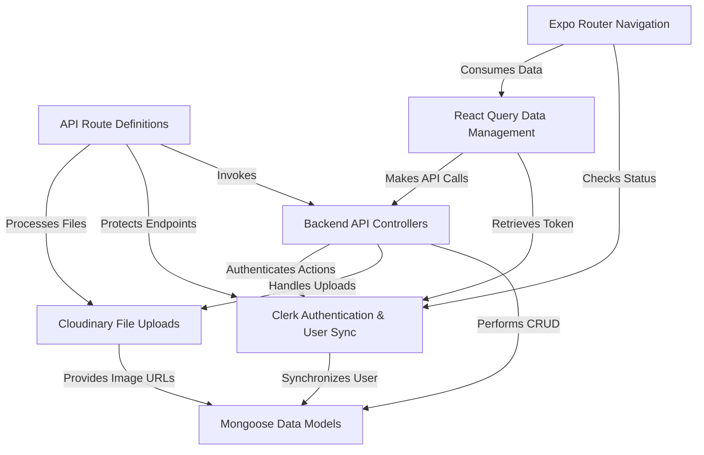

# Tutorial: 3s-connect-react-native

This project is a **full-stack social media application** built with a *React Native mobile app* and a *Node.js backend*. It allows users to **authenticate** (sign up/login), create and share *posts with text and images*, like and comment on others' posts, and receive *notifications*. The app intelligently manages data through **caching** and *efficient API interactions* to provide a smooth user experience, while the backend handles **secure storage** and *business logic*.

## Visual Overview

## Chapters

1. [Clerk Authentication & User Sync
](01_clerk_authentication___user_sync_.md)
2. [Expo Router Navigation
](02_expo_router_navigation_.md)
3. [Mongoose Data Models
](03_mongoose_data_models_.md)
4. [Cloudinary File Uploads
](04_cloudinary_file_uploads_.md)
5. [Backend API Controllers
](05_backend_api_controllers_.md)
6. [API Route Definitions
](06_api_route_definitions_.md)
7. [React Query Data Management
](07_react_query_data_management_.md)

Now that our frontend knows how to beautifully manage data, let's explore how we handle the visual side of things.

---

